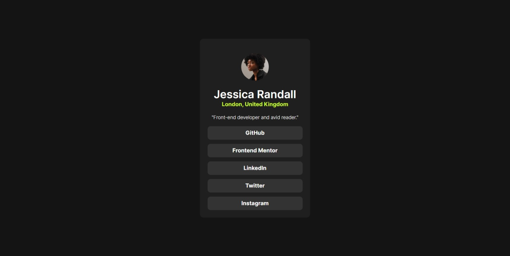
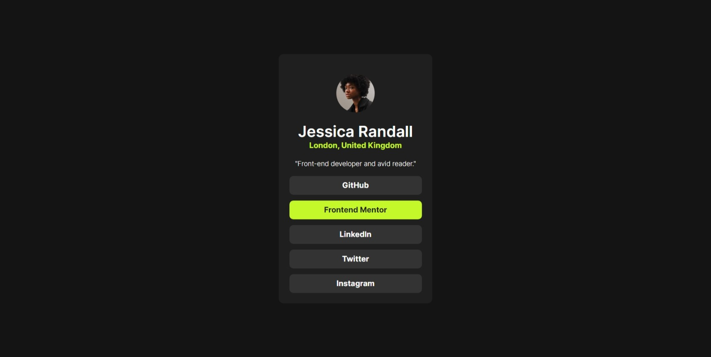
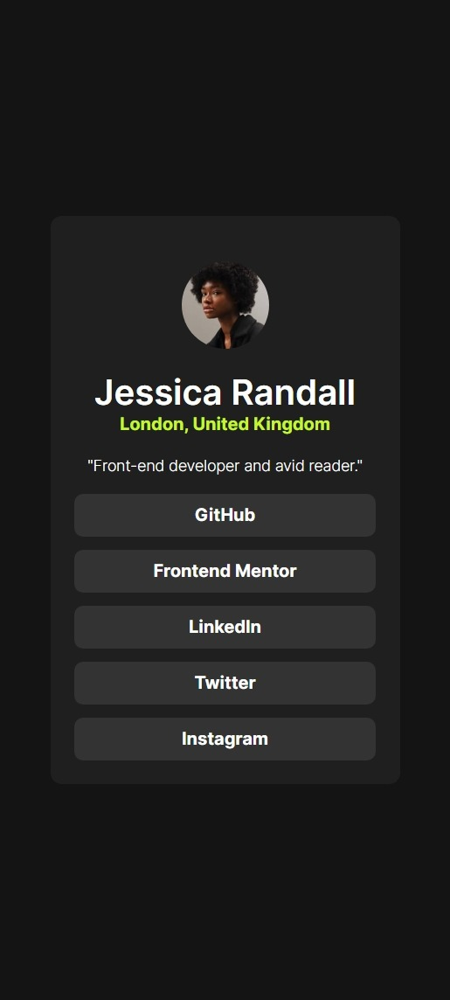

# Frontend Mentor - Social links profile solution

This is a solution to the [Social links profile challenge on Frontend Mentor](https://www.frontendmentor.io/challenges/social-links-profile-UG32l9m6dQ). Frontend Mentor challenges help you improve your coding skills by building realistic projects. 

## Table of contents

- [Overview](#overview)
  - [The challenge](#the-challenge)
  - [Screenshots](#screenshots)
  - [Links](#links)
- [My process](#my-process)
  - [Built with](#built-with)
- [Author](#author)

## Overview

### The challenge

Your challenge is to build out this social links profile and get it looking as close to the design as possible.

You can use any tools you like to help you complete the challenge. So if you've got something you'd like to practice, feel free to give it a go.

Your users should be able to: 

- See hover and focus states for all interactive elements on the page

## Screenshots
### Desktop view

### Desktop view active

### Mobile view

### Links

- Solution URL: [solution link](https://github.com/DDeepanshu99/social-links-profile-main)
- Live Site URL: [live site link](https://social-links-profile-main-lac.vercel.app/)

## My process

### Built with

- HTML5 markup
- CSS

## Author

- GitHub - [@DDeepanshu99](https://github.com/DDeepanshu99)
- Frontend Mentor - [@DDeepanshu99](https://www.frontendmentor.io/profile/DDeepanshu99)
